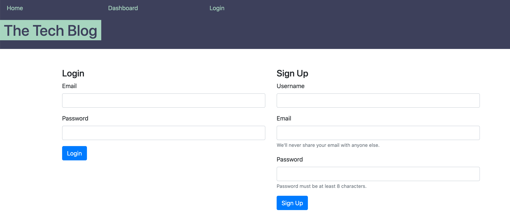
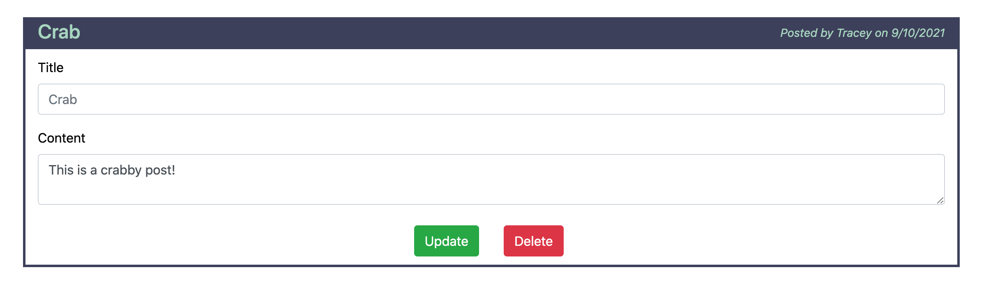

# Tech-Blog

The Live [Web Application](https://safe-castle-68945.herokuapp.com/)

  ## Table of Contents
  * [Description](#description)
  * [Technologies Used](#technologies-used)
  * [Installation](#installation)
  * [Contributing](#contributing)
  * [Questions](#questions)

  ## License 
This project is covered under the MIT License.
    
  
  
  Click on the badge to see **MIT License** details.

  ## Description
  Tech forum in which you can log in, write posts, comment on posts, and edit your posts.

  ## Technologies Used
  - JavaScript

  - Handlebars.js

  - Node.js

  - Sequelize

  - Express.js

  - Bootstrap

  
  

  ## Installation
  Run 'npm i' in directory terminal.

  ## Contributing
  Let me know if you have recommendations and we can work something out!

  ## Questions
  
  [github.com/jeffMullen](https://github.com/jeffMullen)

  If you have additional questions, feel free to reach me at jeffmullendev@gmail.com
